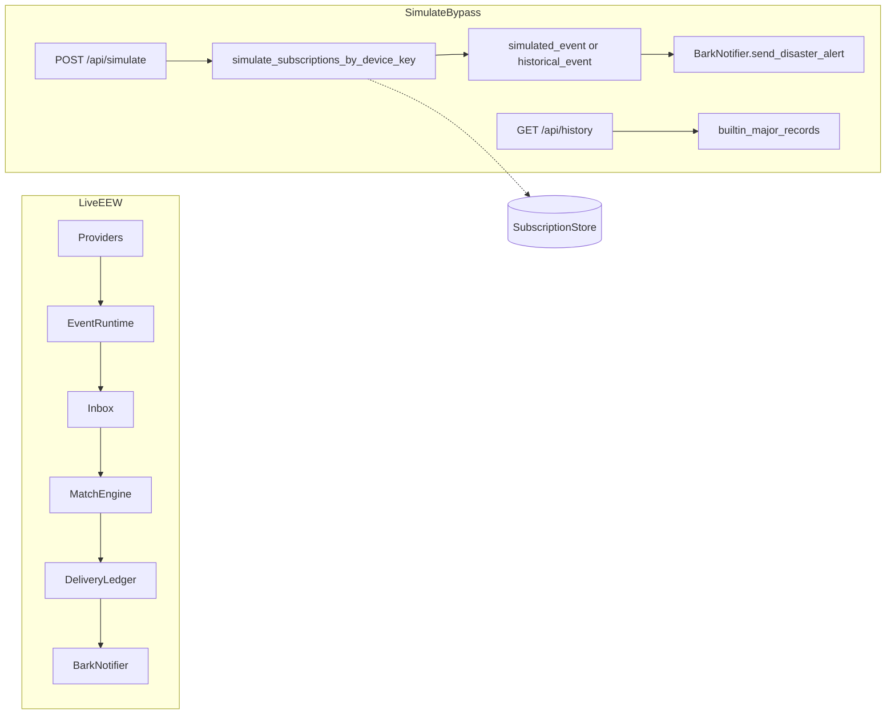

# 模拟测试旁路

`POST /api/simulate` 与 `GET /api/history` 是用户面测试口：对齐 saevio / earthquake-alert「对自己的 Bark Key 试推」的用法，**不是**运营全站扇出，也**不**把事件注入直播 EEW 管道。

字段级 HTTP 契约以 [OpenAPI](openapi.yaml) 为准。本文说明架构边界、查找规则和测试方法。

## 目的与非目标

**有**

- `Authorization: Bearer <device_key>` 鉴权（字符集与长度规则与订阅接口相同）
- 按模式合成假震中，或回放内置历史目录，只对显式目标设备调用 Bark
- 可选 JSON `device_ID_list` 限制推送对象

**无**

- 不调用 `EventRuntime::submit_*`，不写入 inbox / MatchEngine / 投递账本
- 因此 `GET /api/deliveries` 查不到这次试推
- 不复制 saevio 的 `POST /api/simulate?token=` 对 `store.List()` 全站扇出
- 没有独立的 `POST /api/simulate-history`（历史回放合并进同一个 `POST /api/simulate`）
- 第一版历史目录只有 `source=major`，没有 Wolfx `cenc` / `jma` 列表
- 不改 [disaster-alert-web](https://github.com/luyi2008/disaster-alert-web)

`POST /api/simulate` **不**要求 `INSTANCE_TERMS_ACCEPTED`。创建订阅的 `POST /api/subscribe` 仍然要求该门禁。

## 数据流

直播 EEW 与模拟旁路共用 `BarkNotifier` 和订阅存储，入队路径完全分开。



直推走 [`dispatch` / `send_one`](../src/simulate/mod.rs)：估算 P/S 波到达时间后调用 `BarkNotifier::send_disaster_alert`。会 `persist_prepared` 通知详情上下文，因此 Bark 里的详情链接可以打开；**不会**增加 `inbox` / `match_jobs` / `delivery_batches`。

波速取自 `AppState` 的 `p_wave_km_s` / `s_wave_km_s`（环境变量 `P_WAVE_KM_S` / `S_WAVE_KM_S`，默认 6.0 / 3.5）。

## HTTP 与两种互斥模式

`POST /api/simulate` 的查询参数必须二选一，没有默认模式；两个都给或两个都不给 → 400。

### Mode A：`notify_level`

`notify_level=passive|active|critical`（不是 saevio 的 `kind=small|medium|large`）。

[`simulated_event`](../src/simulate/mod.rs) 按目标订阅的监测点和地震预警烈度带放置假震中，使估算烈度落在该 Bark 中断级别。事件标记 `training: true`。成功时 `event_id` 形如 `SIM-<UTC紧凑时间>`。

### Mode B：历史目录回放

`source=major` 且 `key=` 为目录条目 id：

| key | 说明 |
| --- | --- |
| `yibin-gaoxian-2026` | 宜宾高县 5.5 |
| `wenchuan-2008` | 汶川 Mw7.9 |
| `tangshan-1976` | 唐山 7.8 |

震中/震级/深度用目录；发震时刻视为现在。[`historical_event`](../src/simulate/mod.rs) 标记 `training: false`。旁路不经过 `EventRuntime`，因此实例的 `IGNORE_TRAINING` 不影响这次推送。成功时 `event_id` 形如 `HIST-MAJOR-<目录event_id>-<UTC紧凑时间>`。

其它 `source`（例如 `cenc`）→ 400「不支持的历史目录」。目录中找不到 `key` → 404「未找到该历史地震」。

### 推送目标

- 空 body（或 `{}`）：只推当前 Bearer 这一把 Key。该 Key 在本实例没有已激活、也没有待确认订阅 → 404。
- 可选 JSON `{ "device_ID_list": ["keyA", "keyB"] }`（`deny_unknown_fields`，最多 32 个，空数组 → 400「device_ID_list 不能为空」）。只推列表中的 Key，不会额外广播给其他订阅者。列表里没有订阅的 Key 记入 `skipped`，整次请求仍 200。

`GET /api/history?source=major` 公开只读，返回上述三条目录。带有效 Bearer 时，按该 Key 已存监测点标注 `distance_km`、`hypocentral_km`、`estimated_intensity`。

## 订阅查找

[`SubscriptionManager::simulate_subscriptions_by_device_key`](../src/subscriptions/manager.rs)：

1. 忽略 ASCII 大小写匹配 **已激活** 订阅
2. 若没有，取该 Key 最新一条 **待确认** 订阅

空 body 且两步都没有命中 → 404「未找到该 Bark Key 的已激活订阅，请先 POST /api/subscribe」。

404 表示**本实例**的存储里没有这份订阅。其它站点（saevio、网页草稿、另一套 `DB_PATH`）里的 Key 不算。

## 隐私

文档、测试夹具、Issue 只用合成 Key（例如 `targetKey` / `yourBarkKey`）。真实 Bark Key 不得写入仓库。日志继续走 `mask_device_key`。

## 自动化测试

不向真实 Bark 发请求。路由测试在 [`src/routes/simulate.rs`](../src/routes/simulate.rs) 起本机 mock Bark，从 POST JSON 里捕获 `device_key`。合成与目录逻辑在 [`src/simulate/mod.rs`](../src/simulate/mod.rs)。

```bash
cargo test --lib simulate
```

或全量 `cargo test --lib`。夹具 Key 必须是合成值。

### 模块测试

| 测试 | 断言 |
| --- | --- |
| `utc_compact_round_trips_a_known_instant` | UTC 紧凑时间与 RFC3339 |
| `builtin_catalog_contains_live_major_keys` | 目录 key 为宜宾 / 汶川 / 唐山三条 |
| `simulated_event_hits_the_requested_notify_band` | 三个 `notify_level` 都能打中对应中断带，且 `training` |
| `historical_event_keeps_catalog_coordinates` | 宜宾坐标与震级，且非 `training` |
| `yibin_preview_matches_chengdu_distance_scale` | 成都监测点到宜宾约 230–250 km |
| `resolve_device_keys_defaults_to_bearer_and_rejects_empty_list` | 空 body 用 Bearer；空列表拒绝 |

### 路由测试（mock Bark）

| 测试 | 断言 |
| --- | --- |
| `simulate_without_bearer_fails` | 无 Authorization → 401「Bark Key 验证失败」，mock 无 POST |
| `unknown_bearer_key_is_not_found` | 未知 Key → 404，mock 无 POST |
| `bearer_key_matches_stored_subscription_case_insensitively` | `TARGETKEY` 命中已存 `targetKey` |
| `pending_confirmation_can_receive_simulate_push` | 待确认订阅可推 |
| `empty_device_list_is_bad_request` | `device_ID_list: []` → 400 |
| `simulate_modes_are_mutually_exclusive` | 两模式都给/都不给 → 400；未知历史 key → 404；`source=cenc` → 400 |
| `bearer_only_pushes_the_current_key` | 只打 Bearer；`inbox` / `match_jobs` / `delivery_batches` 均为 0 |
| `device_list_does_not_fan_out_to_other_subscribers` | 列表含缺失 Key → `pushed=1, skipped=1`，第二把订阅不被打到 |
| `history_replay_uses_catalog_event_id` | `event_id` 前缀 `HIST-MAJOR-CENC-202606290012-` |
| `history_catalog_is_public_and_can_annotate_a_subscription` | 无 Bearer 无距离；带 Bearer 才有 `distance_km` |
| `unsupported_history_source_is_rejected` | `GET /api/history?source=cenc` → 400「不支持的历史目录」 |

## 手动测试

默认监听 `http://127.0.0.1:30010`。先 `cp .env.example .env`，填写 `ALERT_SIGNING_KEY`，并设 `INSTANCE_TERMS_ACCEPTED=true`（否则无法订阅）。不要让 Docker 与本机 `cargo run` 共用同一 `DB_PATH` 却打错端口。

用**本实例**刚订阅成功的同一把 Key（下面用 `yourBarkKey` 占位，换成你的测试 Key，不要把真实 Key 提交进仓库）：

```bash
# 确认本实例已有订阅
curl -sS "http://127.0.0.1:30010/api/status"

# Mode A：按中断级别合成假震中
curl -sS -X POST "http://127.0.0.1:30010/api/simulate?notify_level=active" \
  -H "Authorization: Bearer yourBarkKey"

# Mode B：回放宜宾高县
curl -sS -X POST "http://127.0.0.1:30010/api/simulate?source=major&key=yibin-gaoxian-2026" \
  -H "Authorization: Bearer yourBarkKey"

# 只对列表中的 Key 推送（列表里没有订阅的记 skipped）
curl -sS -X POST "http://127.0.0.1:30010/api/simulate?notify_level=critical" \
  -H "Authorization: Bearer yourBarkKey" \
  -H "Content-Type: application/json" \
  -d '{"device_ID_list":["yourBarkKey"]}'

# 公开目录；加 Bearer 时带距离/烈度标注
curl -sS "http://127.0.0.1:30010/api/history?source=major"
curl -sS "http://127.0.0.1:30010/api/history?source=major" \
  -H "Authorization: Bearer yourBarkKey"
```

若尚未订阅，先 `POST /api/subscribe`（见 OpenAPI 示例）。订阅成功后再打 simulate。

### 排障

| 现象 | 含义 |
| --- | --- |
| 401「Bark Key 验证失败」 | 缺少或格式无效的 Bearer |
| 404「未找到该 Bark Key 的已激活订阅…」 | 本实例没有该 Key 的已激活或待确认订阅 |
| 404「未找到该历史地震」 | `source=major` 但 `key` 不在内置目录 |
| 400「不支持的历史目录」 | `source` 不是 `major` |
| 400「查询参数无效」/ 模式相关文案 | `notify_level` 与 `source`/`key` 同时出现或同时缺失 |

仍 404 时看 `GET /api/status` 的 `total_subscriptions`。值为 0 说明订阅没写进当前进程使用的数据库。
