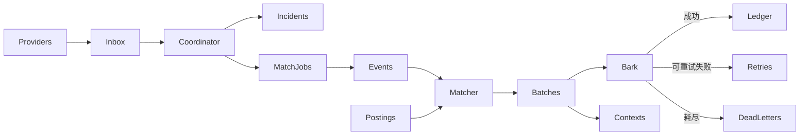

# 存储模型

服务用 [Fjall](https://github.com/fjall-rs/fjall) 键值库，不是 SQL。目录由 `DB_PATH` 指定（默认 `./data/disaster-alert.fjall`），同一目录只能由一个进程打开。逻辑分区是 **keyspace**，作用相当于表；当前共 23 个，定义在 `src/storage/fjall.rs`。

本文说明：数据怎么流、每个 keyspace 干什么、`incident` 和 `event` 的差别、什么会留下、过期窗口和保留期限分别管什么。字段级 HTTP 契约仍以 [OpenAPI](openapi.yaml) 为准。

## 概念

数据源推来的每一版报文是 **event**（`DisasterEvent`）。现实里的一场灾害是 **incident**（`IncidentRecord`）。

一次新疆地震，FAN Studio 报一条、Wolfx 再报一条，是两份 event 形态的数据，合成 **一个** incident。匹配引擎和 Bark 正文读的是某一版 event 快照；管理接口和详情页时间线读的是 incident 档案。

| | event | incident |
| --- | --- | --- |
| 对应什么 | 某源的一版报文 | 现实中的一场灾害 |
| 数量 | 一报一版，可有很多 revision | 一场通常一个 |
| 存储键 | `events` 里的自增 `event_revision` | `incidents` 里的 `incident_id` |
| 典型寿命 | 匹配/推送期间；无人引用约 7 天 | 通知成功后约 180 天 |
| 谁读 | 匹配、Bark 正文、详情快照 | 管理事件列表、多源去重、报告时间线 |

同一来源、同一个 `event_id` 复用同一个 incident。不同来源但时间、地点、震级接近（约 120 秒、100 km、震级差 1）也会并入同一 incident。

地震预警和地震速报走同一套 keyspace，用记录上的 `category` 区分。没有单独的「全国地震目录」表：Wolfx `cenc_eqlist` 每次只取最新一条，FAN Studio 也是当前最新快照。

## 数据流

`inbox` 里的 event 先归并进 incident。若决定通知，再把**这一版** event 写入 `events` 并挂上 `match_job`。没有订阅命中时，incident 和 event 都不会长期留下。

重启后 `EventRuntime::recover()` 会把未完成的 inbox、匹配任务、投递批次重新入队；到期的 retry 由独立的 retry 引擎扫描。

## Keyspace

按流水线分组。名称与 Fjall 分区名一致。

### 接入

| Keyspace | 职责 |
| --- | --- |
| `inbox` | 刚收到、还没处理完的灾害事件。处理完即删。 |
| `rejected_inbox` | 处理失败被隔离的事件（例如 incident 容量超限），带拒绝原因。 |

### 事件与 Incident

| Keyspace | 职责 |
| --- | --- |
| `incidents` | 一场灾害的聚合记录：来源、时间线、是否通知过订阅者。 |
| `incident_aliases` | `event_key → incident_id`，同一来源同一事件复用档案。 |
| `incident_aliases_by_incident` | 上面的反向索引，删 incident 时一起清 alias。 |
| `incident_correlation` | 不同来源、时空接近的地震合成同一个 incident。 |
| `incident_correlation_by_incident` | 相关索引的反向，方便删除。 |
| `events` | 某次匹配任务对应的完整报文快照。没人订阅命中就会删掉。 |
| `match_jobs` | 待做的「把这条事件拿去匹配订阅」任务。 |

### 订阅

| Keyspace | 职责 |
| --- | --- |
| `subscriptions` | 用户提交的订阅原文：Bark、监测点、各灾种规则。 |
| `subscriptions_by_destination` | `Bark URL + Key → 订阅`，同一设备覆盖写入。 |
| `compiled_subscriptions` | 编译后的匹配结构（坐标、H3、震级阈值等）。 |
| `postings` | 倒排索引（按灾种、来源、H3、行政区），用来找出候选订阅。 |

### 推送

| Keyspace | 职责 |
| --- | --- |
| `delivery_batches` | 一批待发或在发的 Bark 通知。 |
| `delivery_progress` | 这一批发到第几条，避免重启后重复扇出。 |
| `delivery_by_destination` | 按设备看待发批次，同一 Bark 目标串行发送。 |
| `retries` | 失败后要重试的推送指针（批次、行、设备、下次到期、已试次数）。 |
| `retries_by_destination` | 按设备查重试。 |
| `retries_by_batch` | 按批次查重试。 |
| `dead_letters` | 重试耗尽后的死信。 |
| `ledger` | 成功投递账本。`GET /api/deliveries` 读这里。 |
| `contexts` | Bark 详情页快照。 |

### 元数据

| Keyspace | 职责 |
| --- | --- |
| `meta` | 库格式版本、自增 ID、各数据源 replay cursor、订阅确认租约。 |

## 什么会留下

不是「台网全量历史都在库里」。地震速报只要本进程接入过，就会留下 incident 档案，**不要求**当时有订阅命中。`GET /api/admin/events` 列出这些记录；`has_matched_subscribers` 区分「接入了」和「有人收到」。

预警、气象、海啸、台风未命中时仍不建档。下列情况也不会长期写入 `incidents`：

- 演练或取消按策略跳过，且这场灾害从未通知过、也还没有速报档案
- 预警等非速报超出[过期窗口](#过期窗口与保留期限)，且从未通知过

过期的地震速报**不通知**，但**会建档**。未命中速报的 `events` 快照在匹配结束后删除，incident 按保留天数留下。

成功推到 Bark 的，另外写入 `ledger`（投递记录）和 `contexts`（详情快照）。

目录完整度受上游限制：Wolfx `cenc_eqlist` 只取当前最新一条，FAN Studio CENC 也是当前快照，不是列表回放。停机期间或同时发生、未出现在「最新一条」里的地震不会仅因保留策略而出现。产品决策见 [prd/earthquake-report-catalog.md](prd/earthquake-report-catalog.md)。

`POST /api/simulate` 不走这条流水线，不会写入 `inbox` / `incidents` / `match_jobs` / `ledger`。旁路边界见 [simulate.md](simulate.md)。

订阅本身（`subscriptions` 及相关索引）一直保留到用户 `DELETE /api/unsubscribe`，不受 incident 保留天数约束。`rejected_inbox`、`dead_letters` 和 `meta` 目前也不在按天数清理的范围内。

## 过期窗口与保留期限

两套时钟，不要混用。

**过期窗口**（`STALE_ORIGIN_SECONDS`）决定这条报**此刻要不要通知**。比较的是发震时刻到服务收到该报的时刻。

| 灾种 | 窗口 | 原因 |
| --- | --- | --- |
| 地震预警、气象预警 | 默认 600 秒 | 预警只在震波到达前有用 |
| 地震速报 | 至少 3600 秒 | 台网正式测定常在发震后 8–20 分钟才到 |
| 海啸、台风 | 不按起震时刻丢弃 | — |

`STALE_ORIGIN_SECONDS=0` 关闭该检查。设为 600 时，预警仍是 10 分钟，速报抬到至少 1 小时。这与数据库删除无关：当时推成功了，档案仍按下面的天数保留；过期速报会建档但不通知；过期预警且从未通知，不会留下 incident。

**保留期限**决定已经入库的记录**何时删除**：

| 变量 | 默认 | 删除对象 |
| --- | --- | --- |
| `INCIDENT_RETENTION_DAYS` | 180 | `incidents` |
| `DELIVERY_LEDGER_RETENTION_DAYS` | 180 | `ledger`（须 ≥ incident 保留天数） |
| `NOTIFICATION_CONTEXT_RETENTION_DAYS` | 365 | `contexts` |
| `OPERATION_RETENTION_DAYS` | 7 | 无人引用的 `events` 修订 |

清理时：还在排队的 inbox、匹配任务、投递批次不会删；`ledger` 里仍挂着的 incident 也不会先于账本删掉。

## 为何队列也落盘

`inbox`、`match_jobs`、`delivery_batches`、`retries` 看起来像内存队列，但都写进 Fjall。进程退出后要能接着匹配、接着推。

`retries` 只存指针，不存整条地震正文（正文在对应的 `delivery_batches` 行）。Bark 失败最多重试 12 次、最长 24 小时。部署重启、短暂网络故障时，只放内存会把地震通知丢掉。

运行时另有一层内存状态：到期扫描、每设备一把锁、正在发送的 retry id。那是热路径；磁盘上的记录才是重启后的事实来源。

同类还有 `meta` 里的订阅确认租约：Bark 确认失败后，后台按租约继续试。

若接受「进程挂了这条通知就算了」，这些队列可以改成纯内存。当前设计不接受这一点。

## 相关代码

| 主题 | 位置 |
| --- | --- |
| 打开 23 个 keyspace | `src/storage/fjall.rs` |
| 过期窗口（预警 600s、速报至少 3600s） | `src/events/coordinator.rs` 的 `stale_origin` |
| 多源合成（约 120 秒 / 100 km / 震级差 1） | `src/storage/fjall.rs` 的 `CORRELATION_*` |
| 无人命中则丢掉非速报 incident；速报档案保留 | `commit_incident` / `keep_unmatched_incident` |
| 重试上限 12 次、24 小时 | `src/runtime/pipeline.rs` 的 `MAX_RETRY_*` |
| 按天数清理 | `FjallStorage::prune`、`application.rs` 启动时调用 |
| 重启恢复 | `EventRuntime::recover()` |
